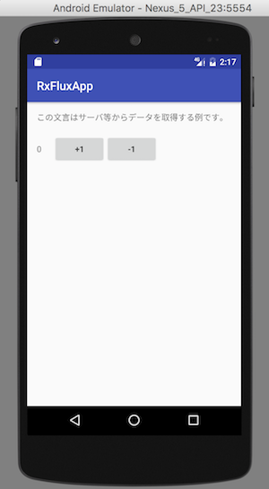
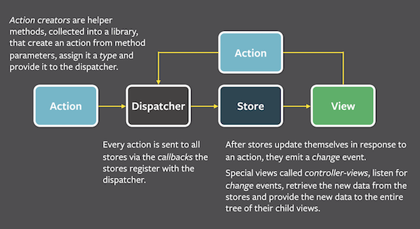

# android-rx-flux-example

## About Flux

> https://facebook.github.io/flux/docs/overview.html

## Document

- [Android で RxJava を利用して Flux してみた](http://qiita.com/hkusu/items/64a9435e1613e4c20ba7)

## Using library

- [Dagger 2 (ver 2.7)](https://github.com/google/dagger)
- [RxJava (ver 1.2.1)](https://github.com/ReactiveX/RxJava)
- [RxAndroid (ver 1.2.1)](https://github.com/ReactiveX/RxAndroid)
- [Gradle Retrolambda Plugin (ver 3.3.0)](https://github.com/evant/gradle-retrolambda)
- [Butter Knife (ver 8.4.0)](https://github.com/JakeWharton/butterknife)

> This project uses Java 8 and [Retrolambda](https://github.com/orfjackal/retrolambda).

## License

MIT
